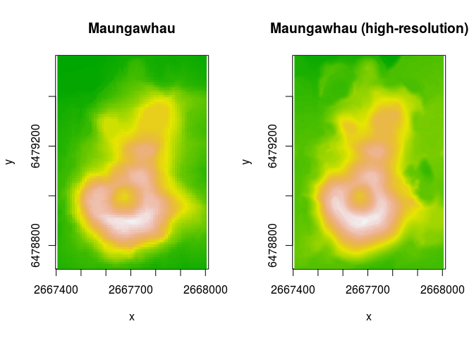
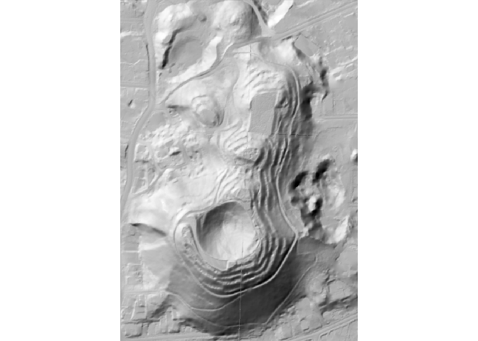
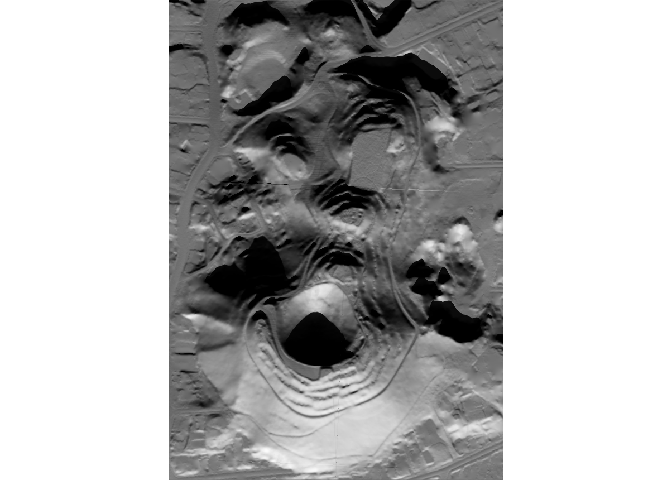

<!-- README.md is generated from README.Rmd. Please edit that file -->

# hillshader

<!-- badges: start -->

[](https://github.com/pierreroudier/hillshader/actions)
<!-- badges: end -->

The `hillshader` package is a wrapper around the `rayshader` and
`raster` packages to create hillshade relief maps using ray-tracing, and
write them to (spatial) files.

## Installation

You can install the development version of hillshader with the `remotes`
package:

``` r
remotes::install_github("pierreroudier/hillshader")
```

## First steps

Below is a quick tutorial of the `hillshader` capabilities:

### The `hillshader` function

The `hillshader` function is the main function of that package, and
allows to create a hillshade map as a `RasterLayer`:

``` r
library(raster)
#> Loading required package: sp
library(rayshader)

library(hillshader)
```

Note that the `hillshader` package includes the `maungawhau` and
`maungawhau_hr` datasets. These are geo-referenced, raster datasets.
`maungawhau` corresponds to the well-known `volcano` dataset. It is a
87 × 61 elevation matrix for Maungawhau, one of the circa 80 volcanoes
in the Auckland volcano filed, in Aotearoa/New Zealand. The
`maungawhau_hr` dataset is a “high-resolution” version of that dataset,
and is a 1 m resolution, 860 × 600 elevation matrix derived from a LiDAR
dataset collected by LINZ.

``` r
layout(matrix(c(1,2), nrow = 1, ncol = 2))
image(maungawhau, asp = 1, main = "Maungawhau", col = terrain.colors(100))
image(maungawhau_hr, asp = 1, main = "Maungawhau (high-resolution)", col = terrain.colors(100))
```



The `hillshader` function can be simply called on a elevation raster to
generate a hillshade `RasterLayer`. By default, the shader used is
`rayshader::ray_shade`, with its default values.

``` r
hs <- hillshader(maungawhau_hr)
plot_map(hs)
```


### Add more shaders!

The `hillshader` function accept a `shader` option, with is a list of
the sucessive shader functions to apply to create the hillshade layer.
The accepeted values must be `rayshader` shader functions (`ray_shade`,
`ambient_shade`, `lamb_shade`), and the order is important.

``` r
hs <- hillshader(
  elevation = maungawhau_hr, 
  shader = c("ray_shade", "ambient_shade")
)

plot_map(hs)
```



### Changing sun position

The `hillshader` function uses the `rayshader` options defaults, but
other values can be specify and passed as arguments:

``` r
hs <- hillshader(
  elevation = maungawhau_hr, 
  shader = c("ray_shade", "ambient_shade"),
  sunangle = 180,
  sunaltitude = 25
)

plot_map(hs)
```



### Saving to file

If a `filename` is passed to `hillshader`, then the resulting hillshade
layer is saved to file. This is a wrapper around `raster::writeRaster`,
and options specific to the latter function can be used.

``` r
hillshader(
  elevation = maungawhau_hr, 
  shader = c("ray_shade", "ambient_shade"),
  sunangle = 180,
  sunaltitude = 25,
  filename = "hillshade.tif"
)
```

## Advanced use in the `rayshader` pipelines

The `hillshader` package provides three functions that can be used
within the `rayshader` pipelines:

-   `add_shadow_2d`: a function that multiplies a shadow map by another
    shadow map, a corrected 2D version of `rayshader::add_shadow`,
-   `matrix_to_raster`: a function that converts a matrix (typically
    used by the `rayshader` functions) back to a `RasterLayer`, for
    input into a GIS workflow,
-   `write_raster`: a function that a hillshade matrix to a raster file
    format.

``` r
library(rayshader)
library(hillshader)

# Create elevation matrix
el_mat <- raster_to_matrix(maungawhau_hr)

el_mat %>%
  # Create hillshade layer using 
  # ray-tracing
  ray_shade %>%
  # Add ambient shading
  add_shadow_2d(
    ambient_shade(
      heightmap = el_mat
    )
  ) %>% 
  # Wirite to GIS file
  write_raster(
    elevation = maungawhau_hr,
    filename = "hillshade.tif"
  )
```
